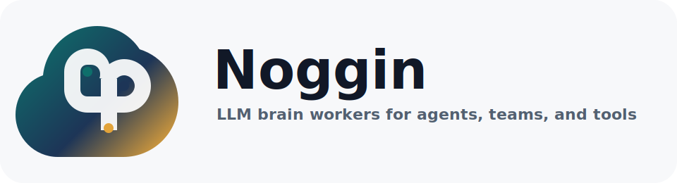

# Noggin

<p align="center">
  
</p>

Noggin is a local-first brain for humans, teams, and AI agents.
It ingests surface activity from Slack, agent sessions, GitHub, and direct CLI
input; sends the content to Noggin Workers, an LLM brain agent; stores
provenance in SQLite; and exposes the brain through CLI, MCP, Hermes, OpenClaw,
a Slack slash command, and a small dashboard.

The product goal is simple: every useful mistake, decision, process detail, and
workflow lesson should become reusable context instead of disappearing at the
end of a chat.

## V1 Surface Map

```
Slack / GitHub / Agent / CLI
          │
          ▼
  source event envelope
          │
          ▼
 validate -> redact -> dedupe -> Noggin Workers
          │                    │
          ▼                    ▼
 append-only event log   observations + entities + edges
          │                    │
          └────────► local SQLite brain ◄──────── skill proposals
                                │
                                ▼
             CLI + MCP + Hermes + OpenClaw + dashboard
```

## Install

```bash
git clone <this-repo>
cd noggin
python3 -m venv .venv
source .venv/bin/activate
pip install -e ".[dev]"
noggin doctor
```

Noggin is LLM-only. Running the CLI, servers, and adapters requires an API key
for the configured provider:

```bash
export NOGGIN_PROVIDER=openai
export NOGGIN_API_KEY=...
export NOGGIN_MODEL=gpt-4o-mini
noggin doctor
```

Supported providers:

| Provider | API key env | Notes |
| --- | --- | --- |
| `openai` | `NOGGIN_API_KEY` or `NOGGIN_OPENAI_API_KEY` | OpenAI chat completions |
| `anthropic` | `NOGGIN_API_KEY` or `NOGGIN_ANTHROPIC_API_KEY` | Anthropic Messages API |
| `gemini` | `NOGGIN_API_KEY` or `NOGGIN_GEMINI_API_KEY` | Gemini generateContent |
| `openrouter` | `NOGGIN_API_KEY` or `NOGGIN_OPENROUTER_API_KEY` | OpenAI-compatible |
| `groq` | `NOGGIN_API_KEY` or `NOGGIN_GROQ_API_KEY` | OpenAI-compatible |
| `together` | `NOGGIN_API_KEY` or `NOGGIN_TOGETHER_API_KEY` | OpenAI-compatible |
| `mistral` | `NOGGIN_API_KEY` or `NOGGIN_MISTRAL_API_KEY` | OpenAI-compatible |
| `ollama` | `NOGGIN_API_KEY` or `NOGGIN_OLLAMA_API_KEY` | OpenAI-compatible local server |
| `custom` | `NOGGIN_API_KEY` | Set `NOGGIN_BASE_URL` |

Optional settings: `NOGGIN_BASE_URL`, `NOGGIN_MODEL`,
`NOGGIN_LLM_TIMEOUT`, and `NOGGIN_TEMPERATURE`.

## Quick Start

```bash
export NOGGIN_PROVIDER=openai
export NOGGIN_API_KEY=...
noggin ingest "Decision: we keep the first version local-first and use MCP as the host-neutral adapter."
noggin ingest --source agent --kind mistake "Mistake: auto-editing skills silently breaks trust. Always create a proposal first."
noggin recall "local-first adapter"
noggin skills propose --content "Mistake: deployment failed because migrations were not listed in the release checklist."
noggin dashboard --open
```

## Adapters

### Local Install For Hermes

```bash
scripts/install-hermes.sh
hermes plugins enable noggin
```

### Local Install For OpenClaw

```bash
scripts/install-openclaw.sh
```

### MCP

```bash
noggin mcp
```

Expose this command as a stdio MCP server. It supports:

- `brain_ingest`
- `brain_recall`
- `brain_reflect`
- `brain_skill_propose`

### Slack

```bash
export NOGGIN_SLACK_SIGNING_SECRET=...
noggin slack serve --port 8787
```

Configure a Slack slash command to POST to `/slack/command`.

Supported slash command text:

- `remember <text>`
- `recall <query>`
- `propose-skill <mistake or workflow lesson>`
- `status`

### GitHub

```bash
noggin github issue owner/repo 123
noggin github pr owner/repo 456
```

Set `GITHUB_TOKEN` for private repositories or higher rate limits.

### Hermes and OpenClaw

Install the generated skill files from `integrations/hermes/SKILL.md` or
`integrations/openclaw/SKILL.md`. Hermes can also load the plugin in
`integrations/hermes/noggin_plugin/`.

## Skill Proposal Safety

Noggin Workers can draft skill changes, but the brain never silently edits
skills by default. It creates a proposal with provenance and an explicit target
path. Applying a proposal requires an allowed root and writes an audit event. If
`--run-tests` is provided, the proposal is rolled back when tests fail.

## Storage

Default database path:

```bash
~/.noggin/brain.db
```

Override with:

```bash
export NOGGIN_DB=/path/to/brain.db
```

## Development

```bash
python -m pytest
ruff check .
```
